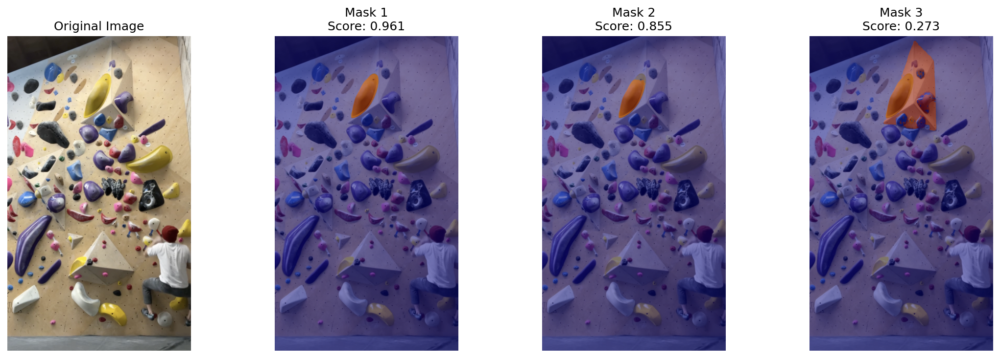

# app-backend



Python server backend to interact with the iOS app for climbing hold segmentation and more, using SAM2.

## Running

```shell
# Step 1: create a Python (>= 3.11) virtual env
# Step 2: enter into that venv
# Step 3: install SAM2 https://github.com/facebookresearch/sam2 as `sam/`

# Then proceed with the following commands:
pip install -r requirements.txt
python app.py
```